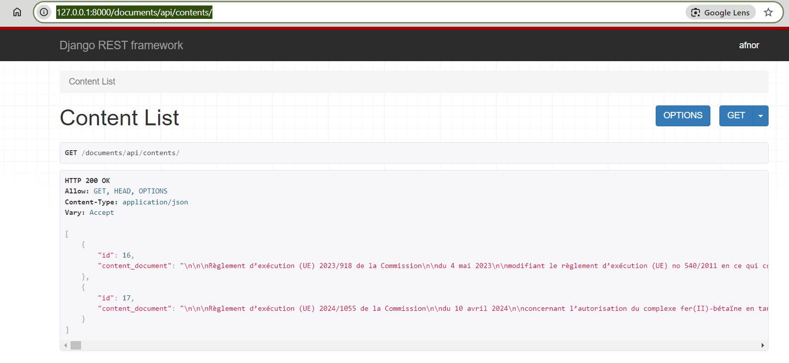

# store_xmlfile_to_sqlite_django

Test technique pour un développeur Python au PDS (Poste de Data Science)

## Description

Sur base des deux fichiers XML fournis, créer une solution permettant le chargement des
données textuelles hors annexes dans une base de données SQLite avec Django. La solution
doit permettre l'import de données en insertion.

Les données dans un fichier XML représentent un document réglementaire. La base de
données doit stocker le contenu afin de reconstituer le corps du document avec ses titres,
ses paragraphes, etc.

`Bonus : une solution pour récupérer un document dans son entièreté est attendue.`

Remarque : ne pas passer plus de 4h sur le test.

## Résultat minimal attendu
- Du code Python typé, formaté avec black
- Une solution exploitant les composants proposés par Django
- Des tests automatisés avec pytest et pytest-django
- La base de données SQLite produite

**Fichiers joints:**
- FR162560.xml
- FR161647.xml

## Solution : How to run this app ?
To run this app you need follow step below :

* `Open your terminal (CLI) :`
  * **Clone this repository :** 
  > - git clone `https://github.com/TouyeAchille/store_xmlfile_to_sqlite_django.git`  

  * **got to the directory :** 
   > - cd store_xmlfile_to_sqlite_django 

  * **create virtual environement and activate it**
      >- python -m venv venv_name
      >- source venv_name/bin/activate
  * **go to the directory :** 
      > - cd xml2database

  * **Install all packages and run app using Makefile:** 
      > - make all
      

Now the server run locally : Starting development server at http://127.0.0.1:8000/

to see or upload content in sqlite django database you can go to your brower  
 > -  http://127.0.0.1:8000/admin  
Then login to django database
 > - username : afnor
 >- passeword : afnor

 Click on button `+add xml documents in django admin`, then upload your xml file, 
 

then click on contents in django admin, you can see the content of all xml file

`Bonus : une solution pour récupérer un document dans son entièreté est attendue`
 use this api to upload all content of documents :
 > -http://127.0.0.1:8000/documents/api/contents/

